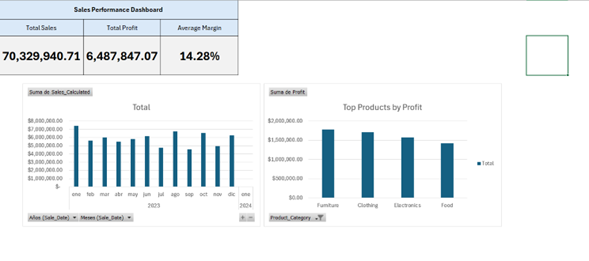

# Sales Performance Dashboard (Excel)

## Project Overview
This project analyzes retail sales data to identify revenue trends, product profitability, and overall business performance.

## Objectives
- Calculate total sales and total profit
- Compute average and weighted profit margin
- Analyze monthly sales trends
- Evaluate profit margin by product category

## Tools Used
- Microsoft Excel
- Pivot Tables
- Data Cleaning
- Financial Metrics Calculation

## Key Metrics
- Total Sales: 70,329,941
- Total Profit: 6,487,847
- Average Margin: 14.28%

## Dashboard Preview

